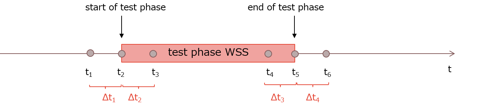

## Einleitung
Für die Untersuchung zur Wirkung des Wildschweinschrecks wurde ein Gebiet im Kanton Bern namens Fanel untersucht. Dort wurden über mehrere Jahre Wildschweine mit GPS-Halsbändern, die im Grundintervall alle 15 Minuten einen Positionspunkt lieferten, getrackt. Im Gebiet dieser Wildschweine wurden Wildschweinschrecks installiert und über unterschiedliche Zeiträume zur Wildschweinvergrähmung genutzt.

Die vorliegende Studie möchte den Einfluss des Wildschweinschrecks untersuchen. Dafür werden unterschiedliche Zeitperioden genauer analysiert. Dies sind

- Δt1: Zeitspanne 5 Stunden und 2 Tage oder 7 Tage vor dem ersten Alarm eines Wildschweinschrecks
- Δt2: Zeitspanne 5 Stunden und 2 Tage oder 7 Tage nach dem ersten Alarm eines Wildschweinschrecks (bzw. in der Anfangsperiode einer Wildschweinschreck-Testperiode)

Bei einer klaren Beeinflussung durch den Wildschweinschreck werden zustätzlich noch folgende Zeitspannen näher untersucht:

- Δt3: Zeitspanne 5 Stunden und 2 Tage oder 7 Tage vor dem letzten Alarm eines Wildschweinschrecks (bzw. in der Endperiode einer Wildschweinschreck-Testperiode)
- Δt4: Zeitspanne 5 Stunden und 2 Tage oder 7 Tage nach dem letzten Alarm eines Wildschweinschrecks

Nachfolgend ist illustriert, welche Perioden analysiert werden.

```{r Zeitperioden, echo=F, message=F, warning=F, fig.cap="Zeitpunkte und Zeitperioden der Untersuchung"}

```

Die Studie unterteilt sich in drei Haupt-Teile. 

1. Anhand einer Voranalyse werden die Daten von mehreren Wildschweinen und Wildschweinschrecks betrachtet, umgeformt, und reduziert. So bleiben reduzierte Datensets zurück, mit denen die eingangs erwähnte Analyse durchgeführt werden kann (die Datensätze werden mit dem Vermerk  *"_relevant"* bezeichnet). 
2. Die erste Forschungsfrage beschäftigt sich mit den Wildschwein-Verhalten (räumlich zeitliche Bewegugsbahnen) vor (Δt1), während (Δt2, Δt3) und allenfalls nach (Δt4) der Wildschweinschreck-Testperiode. Insbesondere der Effektbereich ist von interesse. Dies sind sogenannte **second Order Effects** (Gudmundsson et al., 2012).
3. Die zweite Forschungsfrage beschäftigt sich mit dem Verhalten der Wildschweine in Bezug auf die Umgebung. Es wird untersucht, ob es eine Verschiebung der bevorzugten Umgebung gibt. Dies bezeichnet sogenannte **fist Order Effects** (Gudmundsson et al., 2012). 

Hauptteil 1 wird im nachfolgenden Kapitel dokumentiert:

```{r child='Voranalyse.Rmd'}

```

```{r child='Forschungsfrage 1.Rmd'}

```

```{r child='Forschungsfrage 2.Rmd'}

```

## Diskussion
Leider konnte für die vorliegenden Daten kein Einfluss der Wildschweinschrecks auf die ausgewählten Wilschweine festgestellt werden. Auch ein klarer Effektbereich in Meter konnte anhand dieser Studie nicht definiert werden. Gründe für die unerwartete Reaktion können sehr vielschichtig sein. Vielleicht kannten die Wildschweine die Schrecks aus anderen Jahren (z.B.2014) schon oder das Signal wurde zu stark durch allfällige Barrieren wie Bäume oder hohe Plfanzen reduziert.  

Weiterführende Untersuchungen sollten noch andere Schweine untersuchen,die zum Zeitpunkt des ersten Schrecksignals nahe am Schreck sind. Dabei sollte zumindest für Δt1 und Δt2 darauf geachtet werden, dass die Wildschweine den Schreck noch nicht kennen, um allfällige Verzerrugnen zu vermeiden. Zudem sollte analysiert werden, ob Wildschweinschreck-Richtung und Lautstärke einen Einfluss auf den Effektbereich haben. Ebenfalls wäre zu analyiseren, inwiefern sich die Wildschweine an den Schreck gewöhnen (Δt3 und Δt4). Das musste hier leider vernachlässigt werden, da keine klaren Resultate den Einfluss des Schrecks belegten. Die fist Order Effects könnte man anhand statistischer Methoden weiter untersuchen um beispielsweise zu ergründen, ob die Unterschiede der Aufenthaltsorte siginifkant sind.

 
## Bibliographie
Suter, Stefan, Sandro Stoller, und Benjamin Sigrist. „Prävention von Wildschweinschäden in der Landwirtschaft und Management von Wildschweinen in Schutzgebieten“, 31. Januar 2018. https://www.zhaw.ch/storage/hochschule/medien/news/

Gudmundsson, Joachim, Patrick Laube, und Thomas Wolle. „Computational Movement Analysis“, 2012, 26.


